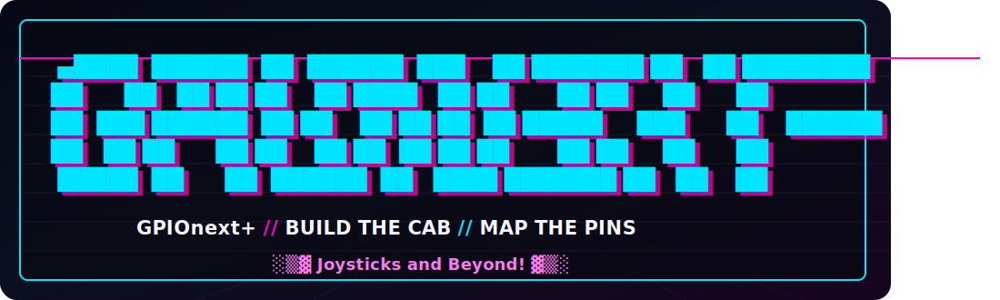

<p align="center">  </p>

[](https://github.com/mholgatem/GPIOnext/releases)
[](https://github.com/mholgatem/GPIOnext/releases/latest)

This is a fully featured GPIO to HID controller Daemon that is fully compatible with RetroPie/PiPlay/Recalbox/Batocera(currently being tested). It includes an intuitive config utility and an easy to use CLI in order to quickly make changes on the fly. In this long overdue revamp, we have fully migrated from Python to Rust. This lower level language gets us closer to the metal reducing the lag induced by the Python interpreter.

<h4>What's New?</h4>
<ul><li>Precompiled Rust binaries for lower latency</li>
<li>Support for popular I2C expanders (MCP23017 & PCF8574) adds virtual GPIO pins for all of your arcade needs</li>
<li>Audio HAT auto detection - automatically detect audio HAT and keep GPIOnext from using those pins</li>
<li>Improved terminal configuration tool allows configuration even on "lite" OS's or over SSH/Xterm</li>
<li>supports matrix pin combinations for additional configurable buttons</li>
<li><b>It supports system commands! (you can map volume/shutdown/etc to buttons)</b></li>
</ul>

<h4>Coming Soon</h4>
<ul><li>Support for ADS1115 I2C analog → digital converter for high resolution joysticks</li></ul>

<br><br>
## 1. Installation

The easiest way to install GPIOnext is to use our bootstrap installer. This will download the latest release and handle all dependencies automatically.

### Latest Version (Recommended)
(root required):
```bash
curl -fL https://raw.githubusercontent.com/mholgatem/GPIOnext/main/manage | bash
```

### Specific Version
If you need to install a specific version (root required):
```bash
curl -fL https://raw.githubusercontent.com/mholgatem/GPIOnext/main/install.sh | bash -s -- install --version v0.1.0
```

### Legacy Version (not compatible with recalBox/batocera)
To install the original Python-only implementation:
```bash
curl -fL https://raw.githubusercontent.com/mholgatem/GPIOnext/refs/heads/Legacy-Code/install.sh | sudo bash
```

---

<br><br>
## 2. Configuration

Once installed, you should run the configuration tool to map your buttons and joysticks.

### -- Basic Setup (retroPi/PiPlay/stock) --
```bash
gpionext config
```

### -- Recalbox Setup --
```bash
Settings menu > Advanced Settings > User Scripts > GPIOnext Configure
```

---
This interactive tool will guide you through:
- Detecting pressed pins.
- Mapping pins to "Commands", "Keys", or "Joypad Buttons/Axes".
- Setting up multi-button combos.

### Peripheral Types
- **Button:** Triggers a standard joystick button (e.g., Button A, Start).
- **Key:** Triggers a keyboard key with auto-repeat.
- **Axis:** Maps pins to analog joystick directions (Up/Down/Left/Right).
- **Command:** Executes a shell command when the button is pressed.


---

<br><br>
## 3. CLI Commands & Settings

GPIOnext provides a powerful CLI wrapper via the `gpionext` command.

### Daemon Management
- `gpionext start`: Enable and start the background daemon.
- `gpionext stop`: Stop the daemon.
- `gpionext reload`: Send SIGHUP to the daemon to hot-reload the configuration without a full restart.
- `gpionext disable`: Stop and disable the auto-start service.

### Updates & Removal
- `gpionext update`: Pull the latest source and binary from GitHub.
- `gpionext update --version <version>`: Update to a specific version.
- `gpionext remove`: Completely remove GPIOnext from the system, including `/opt/gpionext`, the systemd service, and udev rules.

### Diagnostics
- `gpionext journal`: Stream live log output from the daemon (Press Ctrl+C to exit).
- `gpionext test [1-4]`: Run `jstest` on one of the four virtual joypads created by GPIOnext.

### Global Settings
Settings are applied immediately and will restart the daemon:
- `gpionext set combo_delay <ms>`: The window (default 50ms) to detect multi-button combos.
- `gpionext set key_hold_delay <ms>`: The delay (default 350ms) before keyboard auto-repeat starts.
- `gpionext set debounce <ms>`: Button debounce time (default 1ms).
- `gpionext set pulldown <true|false>`: Use internal pulldown resistors (default: false/pullup).
- `gpionext set use_i2c <true|false>`: Enable support for MCP23017 or ADS1115 hardware.
- `gpionext set dev <true|false>`: Enable verbose logging to the system journal.

---

<br><br>
## 4. Running GPIOnext

- **Systemd Service:** GPIOnext runs as a systemd service (`gpionext.service`). It starts automatically on boot if enabled.
- **Physical Pins:** GPIOnext uses physical **BOARD** numbering (1-40) rather than BCM numbering.
- **I2C Safety:** If `use_i2c` is enabled, GPIOnext will automatically avoid claiming pins 3 and 5 (SDA/SCL) as standard GPIOs.
- **Conflicts:** GPIOnext will check for and offer to disable competing drivers like `retrogame`.
- **Hot-Reload:** You can modify your configuration using `gpionext config` while the daemon is running, and then run `gpionext reload` to apply the changes instantly.
